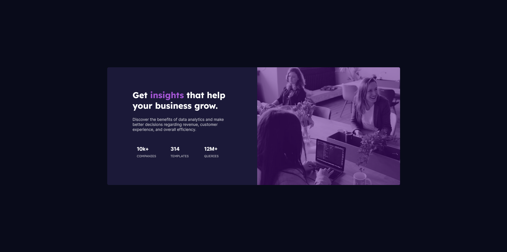
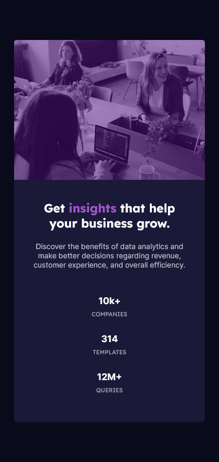

# Frontend Mentor - Stats preview card component solution

This is a solution to the [Stats preview card component challenge on Frontend Mentor](https://www.frontendmentor.io/challenges/stats-preview-card-component-8JqbgoU62). Frontend Mentor challenges help you improve your coding skills by building realistic projects. 

## Table of contents

- [Overview](#overview)
  - [The challenge](#the-challenge)
  - [Screenshot](#screenshot)
  - [Links](#links)
- [My process](#my-process)
  - [Built with](#built-with)
  - [What I learned](#what-i-learned)
  - [Continued development](#continued-development)
  - [Useful resources](#useful-resources)
- [Author](#author)
- [Acknowledgments](#acknowledgments)

**Note: Delete this note and update the table of contents based on what sections you keep.**

## Overview

### The challenge

Users should be able to:

- View the optimal layout depending on their device's screen size

### Screenshot





### Links

- Solution URL: [Add solution URL here](https://your-solution-url.com)
- Live Site URL: [Add live site URL here](https://your-live-site-url.com)

## My process

### Built with

- Semantic HTML5 markup
- CSS custom properties
- Flexbox
- CSS Grid
- Mobile-first workflow


### What I Learned

During the development of this project, I gained valuable insights and learned several important concepts. Here are some of the key learnings:

#### Making the Project Responsive

I learned how to make my project responsive to different screen sizes. One technique I used was using the `clamp()` function for font sizes, which allowed text to scale smoothly across various viewport widths:

```css
font-size: clamp(1.5rem, 1.3241rem + 0.7505vw, 2rem);
```

#### Viewport width

Additionally, I discovered the vw (viewport width) unit, which I used to ensure that elements adapt dynamically to different screen sizes:

```css
/* Example usage of vw unit */
.example-element {
  width: 50vw;
}
```

#### Using Border Radius for Responsive Design

I also learned how to use border radius properties to create responsive designs. By adjusting the border radius based on viewport size, I achieved more flexible and visually appealing layouts:


```css
/* Example usage of border radius for responsiveness */
.example-element {
  border-top-left-radius: 6px;
  border-bottom-left-radius: 6px;
}
```


### Continued Development

As I continue my journey in web development, there are several areas I plan to focus on and improve in future projects:

1. **Advanced Responsive Design**: While I've gained a basic understanding of responsive design principles, I want to delve deeper into advanced techniques such as using media queries, flexbox, and CSS grid to create more complex and flexible layouts that adapt seamlessly to various screen sizes and devices.

2. **Accessibility**: Ensuring that my projects are accessible to users with disabilities is an important aspect of web development that I aim to prioritize. I plan to learn more about accessibility standards, techniques for improving accessibility, and how to incorporate accessibility best practices into my projects from the outset.

3. **JavaScript Mastery**: Although I have a solid foundation in JavaScript, there's always room for improvement. I want to deepen my knowledge of JavaScript by exploring advanced topics such as asynchronous programming, ES6 features, functional programming, and modern JavaScript frameworks/libraries like React, Vue.js, or Angular.

4. **Performance Optimization**: Optimizing the performance of my websites and web applications is crucial for delivering a fast and seamless user experience. I intend to learn more about techniques for optimizing loading times, reducing page size, minimizing render-blocking resources, and improving overall site performance through efficient code, caching strategies, and CDN utilization.

5. **Version Control with Git**: While I've been using Git for version control, I want to enhance my understanding of Git workflows, branching strategies, and collaboration techniques. I plan to explore more advanced Git features and practices to streamline my development process and work more effectively with collaborators on projects.

By focusing on these areas of development, I aim to continuously improve my skills and build more robust, accessible, and high-performing web projects in the future.


### Useful Resources

- [Font Size Clamp Generator](https://clamp.font-size.app/) - This online tool helped me generate font size values using the `clamp()` function, allowing for responsive typography in my project. It simplified the process of calculating font sizes based on minimum and maximum values and viewport width.

- [PX to VW Converter Chrome Extension](https://chromewebstore.google.com/detail/px-to-vw/giddpkhnoflfjlopldfoblpjieknlnoh?hl=en-US&utm_source=ext_sidebar) - This Chrome extension proved to be a valuable resource for converting pixel values to viewport width units (vw) directly within the browser. It facilitated the implementation of responsive designs by providing a quick and convenient way to adapt element sizes based on viewport width.


## Author

- Website - [Stats-preview-card-component](https://www.your-site.com)
- Frontend Mentor - [@naimak659](https://www.frontendmentor.io/profile/yourusername)
- Twitter - [@naimak659](https://twitter.com/naimak659)


## Acknowledgments

I would like to extend my heartfelt thanks to Frontend Mentor for creating challenges like this. These projects provide invaluable opportunities for new web developers like me to gain practical experience and improve our skills. The structured challenges and real-world scenarios presented by Frontend Mentor have been instrumental in my learning journey, and I'm grateful for the platform's contribution to my growth as a developer.

A special tip for beginners: Always remember to read documentation thoroughly, whether it's for frameworks like Tailwind CSS, Bootstrap, React, or any other tool you're using. Documentation provides essential guidance and insights that can greatly enhance your understanding and proficiency. Additionally, consistent practice is key to mastering your craft and achieving excellence.


